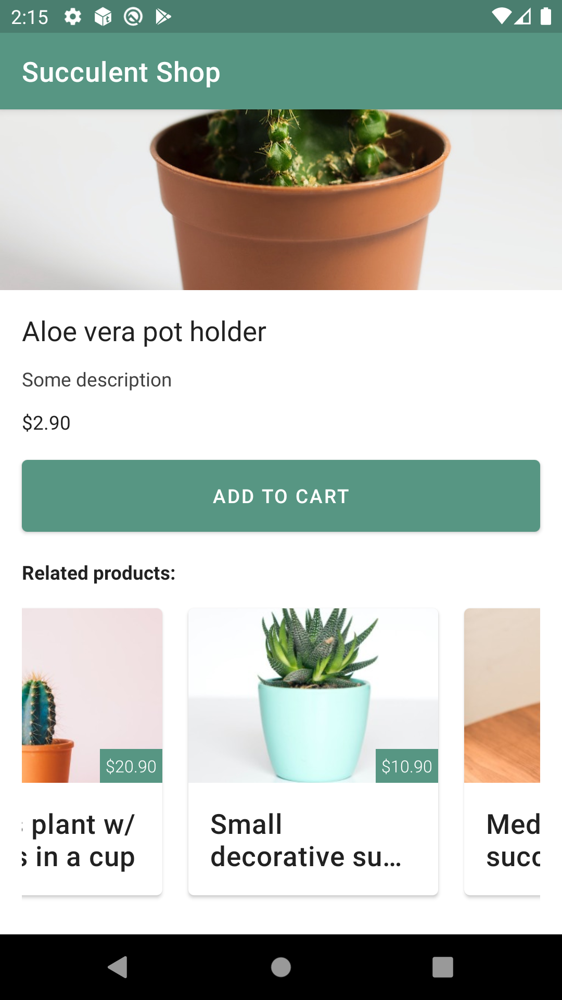

## Succulent Shop

- [Figma Link](https://www.figma.com/file/aKFn9Czmk2ms2hqp4sctcw/Succulent-Shop?node-id=0%3A1)

- [Issue](https://github.com/safaorhan/succulent-shop/issues/2)

<h2>Todo</h2>
<ul>
<li>Create SignupFragment and move logic from SignupActivity into there, deleting SignupActivity.</li>
<li>Add SignupFragment to the nav_graph.xml adding necessary actions.</li>
<li>Add a function <code>fun relatedProducts(productId: Int): List&lt;Product&gt;</code> into ProductStore which returns arbitrary (random or any logic) list of related products</li>
<li>Add the Related Products section into ProductDetailFragment which gets data from ProductStore and displays it in a horizontal RecyclerView.</li>
<li>Add a click listener to the related products which would navigate user to ProductDetailFragment for the clicked product.</li>
</ul>

### What has been done
- Converted signup activity to fragment
- Improved navigation graph
- Added Related Products in Product Details Fragment
- Unit test developed

### Screenshots

